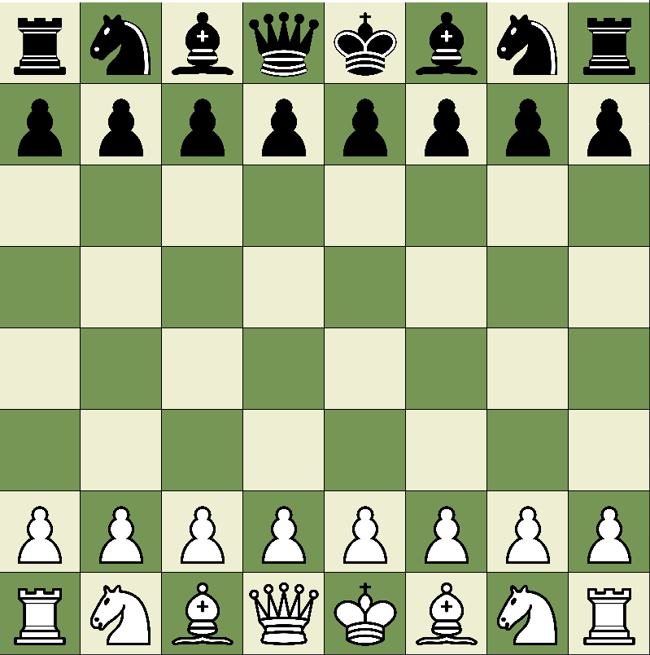

ChessFX
=====

Chess is an abstract strategy game that involves no hidden information and no elements of chance. It is played on a chessboard with 64 squares arranged in an 8×8 grid. The players, referred to as "White" and "Black", each control sixteen pieces: one king, one queen, two rooks, two bishops, two knights, and eight pawns. White moves first, followed by Black. The game is won by checkmating the opponent's king, i.e. threatening it with inescapable capture. There are several ways a game can end in a draw.

This is a recreation of the game created using JavaFX.

